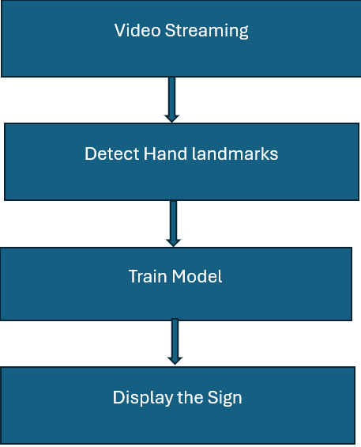

# hackthon-ku-2024


# Sign Savvy

A brief description of what this project does and who it's for:

Sign Language is a unique form of communication primarily used by individuals who are hard of hearing or deaf. It enables people to convey ideas and thoughts through gestures, overcoming the barriers caused by hearing difficulties. However, a significant challenge with Sign Language is the limited knowledge of the language among the general population. Learning Sign Language requires considerable time and effort, which discourages many from acquiring it.

Sign language recognition software leverages computer vision and machine learning technologies to accurately interpret signs. This innovative technology can be integrated into smartphones, tablets, and computers, allowing Deaf and hard-of-hearing individuals to communicate effortlessly with those who can hear.


## Purpose
The purpose of this project is to develop sign language recognition software using computer vision and machine learning techniques. The goal is to create a tool that enables seamless communication between individuals who use sign language and those who do not, thereby promoting inclusivity and accessibility.
## Features

- Real-time recognition of sign language gestures
- Accurate interpretation of a wide range of signs.
- User-friendly interface for easy communication.


## Tech Stack

**Programing Language:** Python

**Packages Used:** cv2, numpy, pandas, mediapipe, keras, matplotlib, seaborn, tensorflow, sklearn


## Run Locally

Clone the project

```bash
  git clone https://link-to-project
```

Go to the project directory

```bash
  cd my-project
```

Install dependencies

```bash
# NumPy
pip install numpy

# Pandas
pip install pandas

# OpenCV
pip install opencv-python

# MediaPipe
pip install mediapipe

# TensorFlow
pip install tensorflow

# Keras (Keras is now part of TensorFlow)
# No separate installation needed if using TensorFlow 2.x

# Matplotlib
pip install matplotlib

# Seaborn
pip install seaborn

# Scikit-learn
pip install scikit-learn
```

To execute program

```bash
  Run the python file
```


## Flowchart



## Lessons Learned

Wow, Soumya and I just wrapped up our first hackathon, and it was quite an adventure! We dove into the deep end by collaborating on our project, which was new territory for us. But you know what? We rocked it!

Throughout the hackathon, we soaked up tons of technical knowledge. We got our hands dirty with all sorts of cool stuff, like playing around with image processing techniques and pipelines. Mediapipe became our best friend for object detection, focusing on hands in our case. And let me tell you, tweaking those machine-learning parameters was both challenging and rewarding. We even got to test our ML model with real-time data, which was super exciting.

As for Chaitanya, he dove headfirst into integrating models with real-time video sources. Talk about a learning curve! But he tackled it like a champ and added a whole new dimension to our project.

All in all, it was an incredible experience, and we came out of it with a boatload of new skills and memories. Can't wait for the next one!


## Challenges

1: Detecting sign language gestures in real time posed challenges with variations in lighting, backgrounds etc.

2: Our model cannot predict some signs accurately due to a large similarity between them.

## Demo

[Demo](https://youtu.be/IGTvJ0fXUWM)

## 


## Team Contributions
Srijanya Chetikaneni - 1st Hackthon - Implemented video streaming and images capturing by cv2
Soumya Baddham - 1st Hackthon - Idea and Implemented Mediapipe
Chaitanya Adepalli - 2nd Hackthon - Model Implementation


